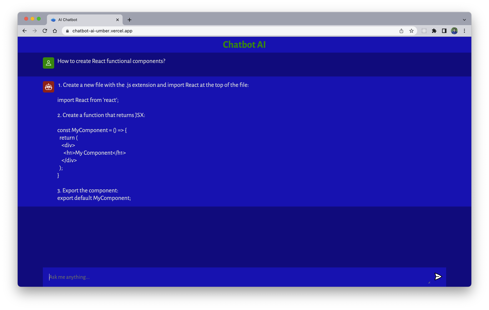

<a name="readme-top"></a>
<!-- PROJECT LOGO -->
<br />
<div align="center">

  <h3 align="center">Chatbot AI</h3>

  <p align="center">
    A fun chatbot using OpenAI's ChatGPT artificial intellenge to make your life easier. Try asking any question! </br>
    <a href="https://chatbot-ai-umber.vercel.app">View Demo</a>
  </p>
</div>


<!-- ABOUT THE PROJECT -->
## About The Project




<p align="right">(<a href="#readme-top">back to top</a>)</p>


### Built With...
##### Frontend:
  * Vite JS 
##### Backend:
  * Node JS
  * Express JS
##### Dependencies:
 * CORS
 * dotenv
 * nodemon
 * openAI ChatGPT API

<p align="right">(<a href="#readme-top">back to top</a>)</p>


<!-- GETTING STARTED -->
## Getting Started

#### Prerequisites

* Node
* openAI API Key


#### Installation

1. Get a free API Key at [https://openai.com/api/](https://openai.com/api/)
2. Clone the repo
   ```sh
   git clone https://github.com/selaguardia/chatbotAI.git
   ```
##### Server Side:
3. Install NPM packages
   ```sh
   npm install
   ```
4. Create a `.env` file and enter your API key
   ```js
   OPENAI_API_KEY = 'ENTER YOUR API';
   ```
5. Run backend server
    ```sh
      npm start server
    ```
##### Client Side: 
6. Install NPM packages
   ```sh
   npm install
   ```
7. Run Vite frontent 
    ```sh
      npm run dev
    ```
<p align="right">(<a href="#readme-top">back to top</a>)</p>


<!-- CONTACT -->
## Contact

Sergio Laguardia</br></br> 
Email me @ sergioslaguardia@gmail.com </br></br>
Want to see more projects? [Visit Portfolio Website](https://www.sergiolaguardia.com/)</br></br>
[![LinkedIn][linkedin-shield]][linkedin-url]</br></br>


</br>


<p align="right">(<a href="#readme-top">back to top</a>)</p>


<!-- MARKDOWN LINKS & IMAGES -->

[linkedin-shield]: https://img.shields.io/badge/-LinkedIn-black.svg?style=for-the-badge&logo=linkedin&colorB=555
[linkedin-url]: https://linkedin.com/in/sergiolaguardia

[product-screenshot]: images/screenshot.png
[Next.js]: https://img.shields.io/badge/next.js-000000?style=for-the-badge&logo=nextdotjs&logoColor=white
[Next-url]: https://nextjs.org/
[React.js]: https://img.shields.io/badge/React-20232A?style=for-the-badge&logo=react&logoColor=61DAFB
[React-url]: https://reactjs.org/
[Vue.js]: https://img.shields.io/badge/Vue.js-35495E?style=for-the-badge&logo=vuedotjs&logoColor=4FC08D
[Vue-url]: https://vuejs.org/
[Angular.io]: https://img.shields.io/badge/Angular-DD0031?style=for-the-badge&logo=angular&logoColor=white
[Angular-url]: https://angular.io/
[Svelte.dev]: https://img.shields.io/badge/Svelte-4A4A55?style=for-the-badge&logo=svelte&logoColor=FF3E00
[Svelte-url]: https://svelte.dev/
[Laravel.com]: https://img.shields.io/badge/Laravel-FF2D20?style=for-the-badge&logo=laravel&logoColor=white
[Laravel-url]: https://laravel.com
[Bootstrap.com]: https://img.shields.io/badge/Bootstrap-563D7C?style=for-the-badge&logo=bootstrap&logoColor=white
[Bootstrap-url]: https://getbootstrap.com
[JQuery.com]: https://img.shields.io/badge/jQuery-0769AD?style=for-the-badge&logo=jquery&logoColor=white
[JQuery-url]: https://jquery.com 


